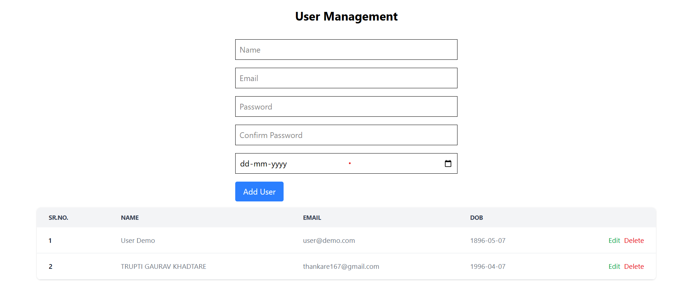

# User CRUD App – Core PHP + React.js + MySQL



This is a full-stack user management application that allows you to perform CRUD (Create, Read, Update, Delete) operations on user data. The stack includes:

- **Backend:** Core PHP with MySQLi
- **Frontend:** React.js (Vite)
- **Database:** MySQL
- **Version Control:** Git + GitHub

---

## 📁 Project Structure

```
reactjs-crud/
├── backend/
│   ├── config.php
│   ├── cors.php
│   ├── db/
│   │   └── reactjs-crud-db.sql
│   └── api/
│       ├── create.php
│       ├── read.php
│       ├── update.php
│       └── delete.php
├── frontend/
│   └── src/
│       ├── App.jsx
│       └── UserForm.jsx
└── README.md
```

---

## 🧱 Technologies Used

| Part         | Tech/Tool          |
|--------------|--------------------|
| Backend      | PHP (MySQLi)       |
| Frontend     | React.js with Vite |
| Database     | MySQL              |
| Styling      | Tailwind CSS        |
| Version Ctrl | Git + GitHub       |

---

## ⚙️ Setup Instructions

### 🗃️ 1. MySQL Database Setup

1. Open PHPMyAdmin or MySQL CLI.
2. Run the following SQL commands:

```sql
CREATE DATABASE reactjs-crud-db;

USE reactjs-crud-db;

CREATE TABLE tbl_users (
    id INT AUTO_INCREMENT PRIMARY KEY,
    name VARCHAR(100),
    email VARCHAR(100) UNIQUE,
    password VARCHAR(255),
    plain_password VARCHAR(100),
    dob DATE
);
```

### 💻 2. Backend Setup (Core PHP)

1. Copy the `backend/` folder into your web server directory (`htdocs` for XAMPP).
2. Start **Apache** and **MySQL** using XAMPP/WAMP.
3. Update your `backend/config.php` with the correct DB credentials if needed:

```php
$servername = "localhost";
$username = "root";
$password = "";
$database = "reactjs-crud-db";
```

4. Test the backend by visiting this URL in browser:  
   `http://localhost/backend/api/read.php`

You should see JSON output of user data.

### 🌐 3. Frontend Setup (React.js)

1. Navigate to the `frontend/` directory.

2. Install dependencies:

```
npm install
```

3. Start the development server:

```
npm run dev
```

4. Open your browser at:  
   `http://localhost:5173`

You will see a form to add users and a list to display them.

> Make sure backend is running at `http://localhost/backend/`. If different, update URLs in Axios requests in `App.jsx` and `UserForm.jsx`.

---

## 🚀 How It Works

- **Add User:** Form sends `POST` request to `create.php`
- **View Users:** Frontend fetches data from `read.php`
- **Update/Delete:** Backend APIs ready (`update.php`, `delete.php`)


---

## 🔁 Features

- ✅ Add, View, Update, Delete users
- ✅ Form validations
- ✅ Password hashing (secure)

---

## 📌 Decisions & 💡 Assumptions

---

### ✅ **Decisions Made**

1. 🧱 **Tech Stack**  
   Used **Core PHP (MySQLi)** for backend and **React.js (Vite)** for frontend to showcase a lightweight full-stack app without advanced frameworks.

2. 🗂️ **API Structure**  
   Followed a REST-like structure using separate PHP files:  
   `create.php`, `read.php`, `update.php`, `delete.php`.

3. 🔐 **Password Handling**  
   - Stored hashed passwords using `password_hash()` for security.  
   - Also stored plain password temporarily in `plain_password` field **only for testing** (not recommended in production).

4. 🧪 **Form Validation**  
   - Client-side validation included for required fields, email format, and password match.  
   - Server-side validation handled in PHP scripts.

5. 🎨 **Styling Choice**  
   Used **Tailwind CSS** for layout, form, and alert styles to keep UI responsive and clean without installing UI libraries.

6. 🔄 **State Management**  
   Basic React useState hooks used for form and user list state.

---

### 🤔 **Assumptions Made**

1. 🌐 The backend will run at `http://localhost/backend/` during development.

2. 🔐 User email must be unique in the database and acts as a user identifier.

3. 🧑‍💻 This app is for **local demo/testing only** — not optimized for production security or performance.

4. ❌ Deletion is permanent from database, although confirmation dialog is included.


## 🚀 Upcoming

- 🔐 User login/auth
- 🌐 Pagination, search

---

## 🧑‍💻 Author

Created by **[Trupti Gaurav Khadtare]**  
For any queries, feel free to contact me.

---

## 📌 License

This project is licensed under the MIT License.
